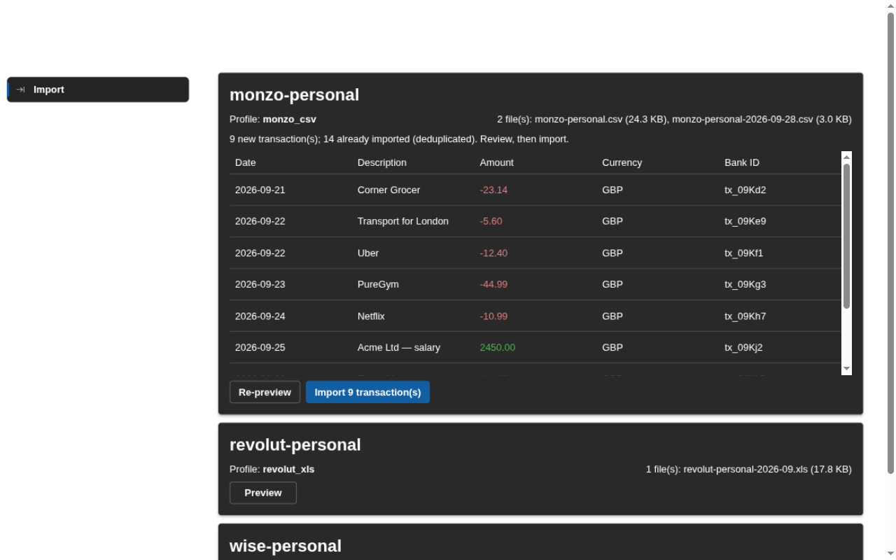
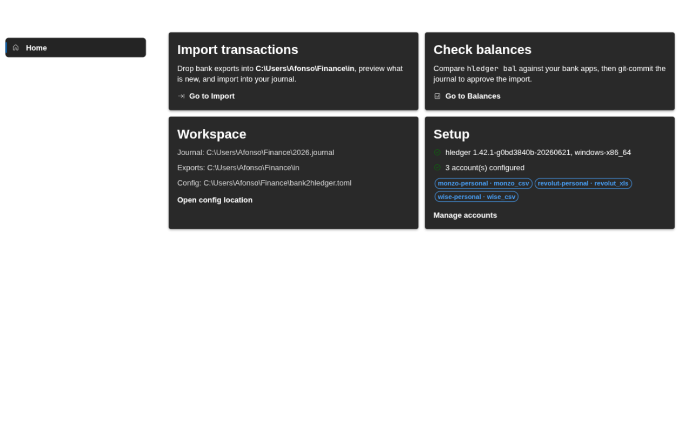
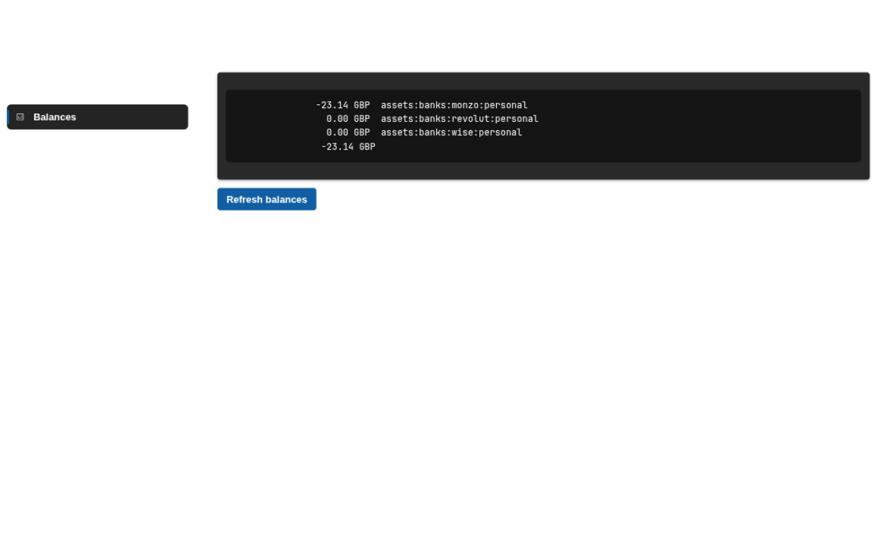
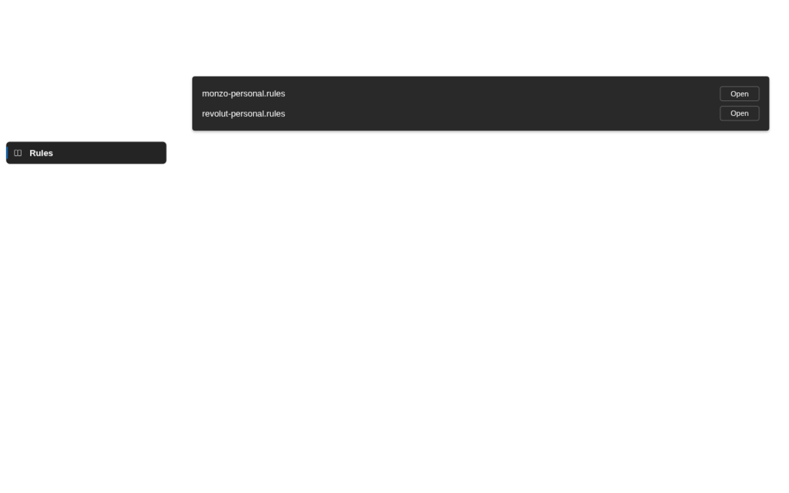

# bank2hledger

Import bank transactions into your [hledger](https://hledger.org) journal — from file exports or live bank APIs — with deduplication, categorization rules, and a **review-before-you-approve** workflow.

Two front-ends share one core library (`crates/bank2hledger`):

- a **CLI** (macOS, Linux, Windows) for terminal-driven workflows, and
- a **Windows GUI app** (`crates/bank2hledger-gui`) styled after Windows 11 Settings, for the same drop → preview → import → verify loop without a terminal.

Built for the reality of modern banking: you can't always get a clean API, but you can almost always get an export. bank2hledger treats a dropped export and an API fetch identically, so you can mix both freely — and move banks or add banks without touching your workflow.

```console
$ bank2hledger import --dry-run     # what's new since last time?
monzo-personal: 12 new transaction(s) (0 already imported)
--- would be added ---
2026-09-14 Corner Grocer
    assets:banks:monzo:personal       GBP-23.14
    expenses:groceries                 GBP23.14
...
(dry run — nothing written; run without --dry-run to import)

$ bank2hledger import               # add them
$ bank2hledger status               # balances, to compare with the bank app
$ git commit                        # your approval
```

## Resolving duplicates interactively

The first import against a journal with hand-entered history is where duplicates hide — you logged the pending £1350 rent, the statement settles it days later at £1347.50 under the bank's own wording. `import -i` stops at each of those:

```
Possible duplicate detected:
  new: 2026-09-03 BIG LANDLORD LTD -1347.50GBP
? Already in your journal? Pick the match, or 'None' to import anyway
  ❯ 2026-09-01 Big Landlord -1350.00GBP  (score 0.83: amount 0.95, date 0.80, payee 0.67, category 1.00)
    None — import the new transaction as it is
```

Arrow keys move between every above-threshold match, **Enter** declares the staged row a duplicate of the selected entry (skipped, and recorded as resolved — never offered again), and picking `None` (or **Esc**) imports the row unchanged. **Ctrl-C** aborts the whole import before anything is written. Use `-i --dry-run` to rehearse; the summary line reports how many rows were skipped as duplicates.

## The Windows GUI

The same review-before-you-approve workflow, in an app styled after Windows 11 Settings (Fluent UI, Mica, light/dark). Drop exports in, preview what's new, import, verify:









## Why not just `hledger import`?

You can — bank2hledger builds on it. What it adds:

- **Account binding by file name.** Exports are matched to your configured accounts by filename (`monzo-personal-*.csv`), so multi-account setups never mis-assign transactions. There is no guessing.
- **Exact duplicate detection.** Bank transaction ids (where exports provide them) are tracked in a seen-file, so two identical coffees on the same day both survive — plain hledger dedup would silently drop one.
- **Overlap detection against hand-entered history.** The tool's dedup can't know about transactions you logged manually before using it. `import --dry-run` therefore also scores each staged row against existing journal entries — date proximity, amount within a small tolerance (FX/fee drift), fuzzy payee similarity, and counter-account agreement — and flags likely duplicates with a score breakdown. It also catches the **other side of transfers**: an entry already logged as a transfer between your own accounts is flagged even when the staged row's payee and category don't match, because the staged side of a transfer always looks like a fresh expense. Advisory only: nothing is dropped automatically. Run with `--interactive` / `-i` to decide each flag at import time: an arrow-key menu lists every match plus `None — import as it is`; skipped rows are recorded as resolved and never re-offered.
- **Starter rules per account.** `init` generates a standard hledger CSV-rules file per account with a catch-all to `expenses:other`; you edit plain hledger syntax, the tool never rewrites it. Unmatched payees are visible in every import for review; each fix makes every future import smarter.
- **A balance checkpoint.** `status` prints the balances of exactly the accounts you import for, so comparing against the bank app is one glance.
- **API fetchers (optional).** Monzo and Wise fetchers write real exports into your drop zone automatically; the rest of the pipeline doesn't know or care.

## Supported banks

| Bank     | Export profile | API fetcher | Notes |
|----------|----------------|-------------|-------|
| Monzo    | `monzo_csv`    | ✅ `monzo`   | fetcher uses the official API (OAuth, read-only) |
| Revolut  | `revolut_xls`  | —           | no official personal API; an unofficial fetcher is on the roadmap |
| Wise     | `wise_csv`     | ✅ `wise`    | fetcher uses personal API tokens (full-access; not scoping-able) |
| Aqua (NewDay) | `aqua_pdf` | —          | monthly PDF statement → `pdftotext`; no CSV export exists |
| *any bank* | `generic_csv` | —          | describe your bank's CSV in config; no code needed |

Contributions for more banks are very welcome — Starling, Chase UK, NatWest, N26 and Amex would all be small profiles. See [docs/adding-a-profile.md](docs/adding-a-profile.md).

## Install

### CLI (macOS / Linux / Windows)

```console
$ cargo install bank2hledger      # or grab a binary from Releases
```

Requires [hledger](https://hledger.org/install.html) on `$PATH`. Aqua PDF parsing additionally needs `pdftotext` (poppler-utils).

### Windows GUI

Three ways to install (all from [GitHub Releases](https://github.com/AfonsoNeto/bank2hledger/releases)):

| Channel | File | Notes |
|---------|------|-------|
| Installer | `bank2hledger-gui_*_x64-setup.exe` (NSIS) or `*.msi` | double-click, installs to Program Files |
| Portable | `bank2hledger-gui_*-portable.zip` | unzip and run — no installation |
| MSIX | `bank2hledger-gui_*.msix` | for Microsoft Store submission / managed deployment (unsigned builds need sideloading enabled and a signature) |

The GUI needs [hledger](https://hledger.org/install.html) installed (e.g. `winget install hledger.hledger`); it checks on startup and tells you if it's missing. The app itself has no other runtime dependencies — it renders with WebView2, which is built into Windows 11 (and updated automatically on Windows 10). API fetchers are not available in the GUI yet; use the CLI for those.

## Setup

```console
$ cd ~/.finance                   # wherever your journals live (a git repo is ideal)
$ bank2hledger init               # writes bank2hledger.toml + directories
$ $EDITOR bank2hledger.toml       # name your accounts and hledger account names
```

Then either drop exports into `in/` (name them after the account, e.g. `monzo-personal.csv`), or set up a fetcher:

```console
$ bank2hledger auth monzo         # one-time OAuth browser flow → OS keychain
$ bank2hledger fetch
```

## The review loop

1. **Get data in**: drop exports into `in/`, or run `fetch`.
2. **Preview**: `bank2hledger import --dry-run` — shows exactly the batch that would be added.
3. **Categorize**: unmatched payees land in `expenses:other`; add a mapping to the account's rules file (`rules/<account>.rules`) and re-run. Mappings are plain hledger regexes, matched case-insensitively; *later rules win*, so the catch-all sits first and specific blocks after it.
4. **Import**: `bank2hledger import -i` — appends only new transactions; re-running or re-dropping files can never duplicate. `-i`/`--interactive` pauses at every possible duplicate (see above) and lets you decide with the arrow keys; without it, duplicates are only flagged for review.
5. **Verify**: `bank2hledger status` — compare against the real balances in your bank apps.
6. **Approve**: `git commit`. To reject a batch: `git checkout -- 2026.journal`, fix the rules, re-run.

## Privacy

- No telemetry, no analytics, no network calls — except the fetchers you explicitly configure.
- Secrets (OAuth client secret, refresh tokens, API tokens) live in your OS keychain, never in config or logs. Without a keychain, a `0600` file under `~/.config/bank2hledger/secrets/` is used, with a warning.
- Your journals, exports, and rules files stay in your private directory. The repo's fixtures are synthetic or fully anonymized.
- Monzo fetcher requests only transaction-read scopes. Wise personal API tokens cannot be scoped — that's a Wise limitation; see [docs/fetchers.md](docs/fetchers.md).

## Development

This repo is a Cargo workspace:

```
crates/bank2hledger        # core library + CLI (this is what crates.io ships)
crates/bank2hledger-gui    # Windows GUI: Tauri 2 + Fluent UI (React) frontend
```

```console
$ cargo test -p bank2hledger          # parser + end-to-end tests (uses real hledger if present)
$ cargo build -p bank2hledger --no-default-features   # verify the offline core builds without fetchers

# GUI development (Node.js ≥ 18 required):
$ cd crates/bank2hledger-gui
$ npm install
$ npm run tauri dev                   # hot-reloading GUI dev loop
$ npm run tauri build                 # release build + NSIS/MSI installers
```

See [CONTRIBUTING.md](CONTRIBUTING.md) and [docs/adding-a-profile.md](docs/adding-a-profile.md).

## License

MIT
